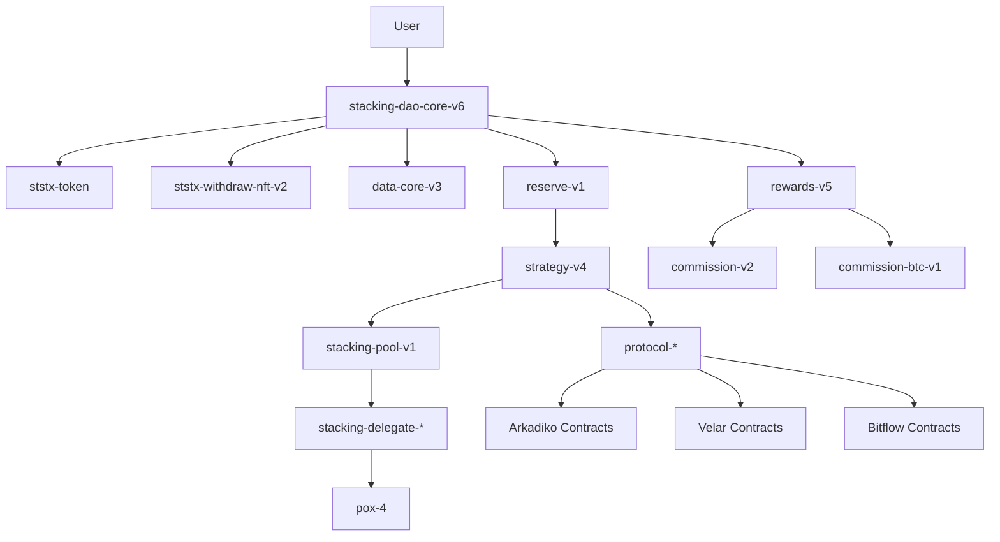

# StackingDAO Architecture

This document provides a comprehensive overview of the StackingDAO protocol architecture, contract design patterns, and system interactions.

## Table of Contents

- [System Overview](#system-overview)
- [Architecture Layers](#architecture-layers)
- [Contract Relationships](#contract-relationships)
- [Data Flow](#data-flow)
- [Security Model](#security-model)

---

## System Overview

StackingDAO is a liquid stacking protocol built on the Stacks blockchain, allowing users to earn stacking rewards while maintaining liquidity through stSTX tokens.

### Core Concepts

```
┌─────────────────────────────────────────────────────────┐
│                         User                            │
└────────────┬────────────────────────────────────────────┘
             │
             │ deposit STX
             ▼
┌─────────────────────────────────────────────────────────┐
│              Stacking DAO Core Contract                 │
│  ┌──────────────────────────────────────────────────┐  │
│  │  • Receive STX                                    │  │
│  │  • Mint stSTX (liquid stacking token)            │  │
│  │  • Manage withdrawals via NFTs                   │  │
│  └──────────────────────────────────────────────────┘  │
└─────────┬───────────────────────────┬───────────────────┘
          │                           │
          │ STX                       │ stSTX
          ▼                           ▼
┌──────────────────────┐    ┌──────────────────────┐
│   Reserve Contract   │    │  User's stSTX Balance│
│  • Hold pooled STX   │    │  • Tradeable         │
│  • Direct stacking   │    │  • Increase in value │
│  • Pool management   │    │  • Collateral        │
└──────────┬───────────┘    └──────────────────────┘
           │
           │ Delegate to stackers
           ▼
┌──────────────────────────────────────┐
│  Stacking Delegates / Pools          │
│  • Stack STX via PoX                 │
│  • Earn BTC rewards                  │
└──────────┬───────────────────────────┘
           │
           │ BTC rewards
           ▼
┌──────────────────────────────────────┐
│      Rewards Distribution             │
│  • Distribute to stSTX holders       │
│  • Commission handling               │
│  • Protocol integrations             │
└──────────────────────────────────────┘
```

---

## Architecture Layers

### Layer 1: User Interface Contracts

**Purpose**: Direct user interaction

**Contracts**:
- `stacking-dao-core-v6.clar` - Main entry point for deposits/withdrawals
- `stacking-dao-core-btc-v3.clar` - BTC rewards handling

**Functions**:
- `deposit` - Convert STX to stSTX
- `init-withdraw` - Begin withdrawal process
- `cancel-withdraw` - Cancel pending withdrawal
- `withdraw` - Complete withdrawal after unlock period

### Layer 2: Token Contracts

**Purpose**: Asset representation

**Contracts**:
- `ststx-token.clar` - SIP-010 fungible token (STX rewards)
- `ststxbtc-token-v2.clar` - BTC rewards token
- `ststx-withdraw-nft-v2.clar` - SIP-009 NFT for withdrawal claims

**Token Mechanics**:

```clarity
;; stSTX represents stacked STX
;; Value increases over time due to rewards
;; Conversion rate: stx-per-ststx

initial-deposit: 1000 STX → 1000 stSTX (1:1)
after-rewards: 1000 stSTX → 1050 STX (1:1.05)
```

### Layer 3: Data Management

**Purpose**: State persistence and queries

**Contracts**:
- `data-core-v3.clar` - Core protocol data
- `data-pools-v1.clar` - Pool statistics
- `data-direct-stacking-v1.clar` - Direct stacking data

**Data Structures**:

```clarity
;; Withdrawal tracking
(define-map withdrawals
  uint ;; NFT ID
  {
    stx-amount: uint,
    ststx-amount: uint,
    unlock-burn-height: uint,
    recipient: principal
  }
)

;; User deposits tracking
(define-map user-deposits
  principal
  {
    total-deposited: uint,
    referrer: (optional principal),
    first-deposit-height: uint
  }
)
```

### Layer 4: Reserve & Strategy

**Purpose**: Manage pooled assets and stacking strategy

**Contracts**:
- `reserve-v1.clar` - STX reserve management
- `strategy-v4.clar` - Distribution strategy across pools

**Strategy Logic**:

```
Total STX Pool
     │
     ├─→ Direct Stacking (60%)
     │   ├─→ Pool 1 (20%)
     │   ├─→ Pool 2 (20%)
     │   └─→ Pool 3 (20%)
     │
     ├─→ Protocol Integrations (30%)
     │   ├─→ Arkadiko (10%)
     │   ├─→ Velar (10%)
     │   └─→ Bitflow (10%)
     │
     └─→ Reserve Buffer (10%)
         └─→ Immediate withdrawals
```

### Layer 5: Stacking Execution

**Purpose**: Interact with PoX and manage delegations

**Contracts**:
- `stacking-pool-v1.clar` - Pool management
- `stacking-delegate-1-1.clar` (and other delegates)
- `delegates-handler-v1.clar` - Delegate coordination

**Stacking Flow**:

```clarity
;; Each delegate can stack independently
;; Coordinated by delegates-handler

(define-public (stack-stx)
  (begin
    ;; 1. Check minimum threshold
    (asserts! (>= available-stx MIN_THRESHOLD) ERR_BELOW_MIN)
    
    ;; 2. Call PoX-4 delegate-stx
    (try! (contract-call? 'SP000000000000000000002Q6VF78.pox-4
      delegate-stx
      amount
      delegate-address
      (some unlock-height)
      (some pox-addr)
    ))
    
    ;; 3. Track delegation
    (ok true)
  )
)
```

### Layer 6: Rewards & Commission

**Purpose**: Distribute earnings and fees

**Contracts**:
- `rewards-v5.clar` - Reward distribution logic
- `commission-v2.clar` - Fee management (STX)
- `commission-btc-v1.clar` - BTC fee handling

**Reward Distribution**:

```
BTC Rewards from PoX
     │
     ▼
┌─────────────────┐
│  rewards-v5     │
│  • Calculate    │
│  • Distribute   │
└────────┬────────┘
         │
         ├─→ Commission (5%)
         │   ├─→ Protocol (3%)
         │   ├─→ Referrer (1%)
         │   └─→ Pool (1%)
         │
         └─→ stSTX Holders (95%)
             └─→ Proportional to holdings
```

### Layer 7: Protocol Integrations

**Purpose**: Third-party DeFi integrations

**Contracts**:
- `protocol-arkadiko-v1.clar` - Arkadiko vaults
- `protocol-velar-v1.clar` - Velar DEX
- `protocol-bitflow-v1.clar` - Bitflow pools
- `protocol-hermetica-v1.clar` - Hermetica BTC rewards

**Integration Pattern**:

```clarity
;; All protocols implement protocol-trait-v1

(define-trait protocol-trait
  (
    (deposit (uint) (response uint uint))
    (withdraw (uint) (response uint uint))
    (get-balance () (response uint uint))
    (claim-rewards () (response uint uint))
  )
)
```

### Layer 8: Helper Utilities

**Purpose**: Common functionality and network info

**Contracts**:
- `direct-helpers-v4.clar` - UI helper functions
- `block-info-v20.clar` - Network state queries
- Various trait definitions

---

## Contract Relationships

### Dependency Graph



### Trait System

```clarity
;; Traits enable modularity and upgradeability

(use-trait reserve-trait .reserve-trait-v1.reserve-trait)
(use-trait commission-trait .commission-trait.commission-trait)
(use-trait staking-trait .staking-trait-v1.staking-trait)
(use-trait protocol-trait .protocol-trait-v1.protocol-trait)

;; Contracts accept trait parameters
(define-public (deposit
  (reserve <reserve-trait>)
  (commission <commission-trait>)
  (staking <staking-trait>)
  (amount uint)
)
  ;; Implementation can work with any contract
  ;; implementing the trait
)
```

---

## Data Flow

### Deposit Flow

```
1. User calls deposit(1000 STX)
       ↓
2. Core validates and calculates
   - Fee: 1000 * 0.5% = 5 STX
   - User amount: 995STX
   - Exchange rate: 1 STX = 0.95 stSTX
   - stSTX to mint: 995 * 0.95 = 945.25
       ↓
3. Transfer STX: user → reserve
       ↓
4. Mint stSTX: 945.25 → user
       ↓
5. Update data-core
   - Total deposited += 1000
   - User stats updated
       ↓
6. Commission distribution
   - Protocol: 3 STX
   - Referrer: 1 STX (if any)
   - Pool: 1 STX (if specified)
       ↓
7. Strategy rebalance (if threshold met)
   - Delegate to pools
   - Invest in protocols
       ↓
8. Event emission
   print: {action: "deposit", amount: 1000, ...}
```

### Withdrawal Flow

```
1. User calls init-withdraw(945 stSTX)
       ↓
2. Core validates and calculates
   - Exchange rate: 1 stSTX = 1.05 STX
   - STX amount: 945 * 1.05 = 992.25 STX
   - Unlock: current-cycle + 2
       ↓
3. Transfer stSTX: user → core (locked)
       ↓
4. Mint Withdrawal NFT
   - NFT ID: auto-increment
   - Metadata: {stx: 992.25, unlock: 12345}
       ↓
5. Store withdrawal data
       ↓
6. Reserve request for future claim
       ↓
--- Wait for unlock period ---
       ↓
7. User calls withdraw(NFT-ID)
       ↓
8. Validate unlock period passed
       ↓
9. Burn NFT and locked stSTX
       ↓
10. Calculate withdrawal fee
    - Fee: 992.25 * 0.25% = 2.48 STX
    - User gets: 989.77 STX
       ↓
11. Transfer STX: reserve → user
       ↓
12. Commission distribution
       ↓
13. Update data-core
       ↓
14. Event emission
```

### Reward Distribution Flow

```
1. PoX cycle completes
   BTC rewards received by delegates
       ↓
2. Keeper calls claim-rewards
       ↓
3. rewards-v5 calculates distribution
   - Total stSTX supply: 1,000,000
   - Total BTC rewards: 10 BTC
   - Per stSTX: 10 / 1,000,000 = 0.00001 BTC
       ↓
4. Commission extraction
   - Protocol: 10 * 3% = 0.3 BTC
   - Net rewards: 9.7 BTC
       ↓
5. Distribute to protocol integrations
   - Each protocol claims proportionally
       ↓
6. Update reward rates
   - Implicit in stx-per-ststx ratio
   - Or explicit reward claims
       ↓
7. Users can claim accumulated rewards
   or sell stSTX at higher rate
```

---

## Security Model

### Access Control

```clarity
;; DAO-controlled protocol
(define-constant DAO_PRINCIPAL (as-contract tx-sender))

;; Multi-level permissions
(define-read-only (check-is-protocol (caller principal))
  (contract-call? .dao is-protocol caller)
)

(define-read-only (check-is-enabled)
  (contract-call? .dao is-enabled)
)

;; Function guards
(define-public (admin-function)
  (begin
    (try! (check-is-protocol contract-caller))
    ;; Admin logic
  )
)
```

### Fail-Safe Mechanisms

1. **Emergency Shutdown**
   ```clarity
   (define-data-var shutdown-deposits bool false)
   
   (define-public (deposit ...)
     (asserts! (not (get-shutdown-deposits)) ERR_DEPOSITS_DISABLED)
     ;; ...
   )
   ```

2. **Minimum Thresholds**
   - Prevent dust attacks
   - Ensure economic viability

3. **Withdrawal Delays**
   - Time-lock for security
   - Allow for monitoring

### Upgrade Strategy

```
Version 1 (Active)
     │
     ├─→ Deploy Version 2
     │
     ├─→ Test Version 2 on testnet
     │
     ├─→ Audit Version 2
     │
     ├─→ DAO proposal to migrate
     │
     ├─→ User migration period
     │   (both versions active)
     │
     └─→ Deprecate Version 1
         (withdraw-only mode)
```

### Invariants

Critical system invariants that must hold:

1. **Token Supply**: `stSTX.totalSupply <= STX.in-reserve / stx-per-ststx`
2. **Solvency**: `reserve.balance >= totalWithdrawalClaims`
3. **NFT Uniqueness**: Each withdrawal NFT ID is unique
4. **Commission**: `totalCommission <= totalDeposits * MAX_COMMISSION`

---

## Appendix

### Gas Optimization Patterns

- Use `let` bindings to avoid re-computation
- Minimize map reads/writes
- Batch operations where possible
- Efficient data structures

### Testing Strategy

- Unit tests for each contract
- Integration tests for flows
- Property-based testing for invariants
- Fuzzing for edge cases

---

*For implementation details, see [api-reference.md](api-reference.md)*
*For deployment info, see [deployment-guide.md](deployment-guide.md)*
